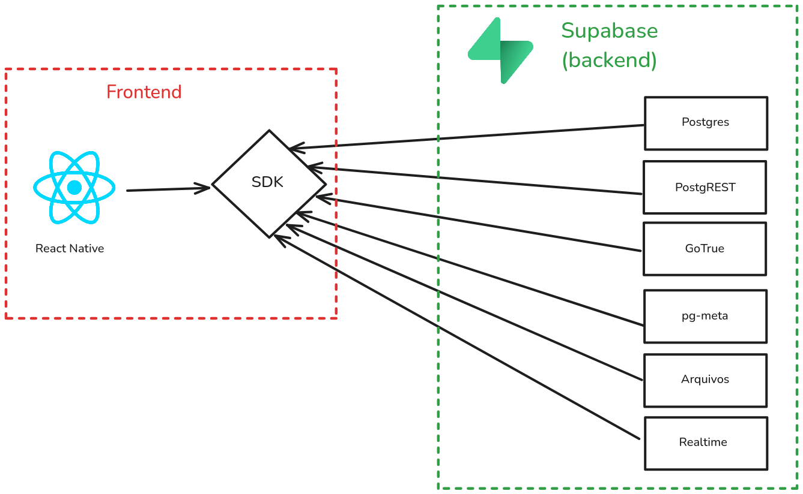

# Especificações do Projeto

Pré-requisitos: <a href="1-Documentação de Contexto.md"> Documentação de Contexto</a>
 
 

## Técnicas e Ferramentas Utilizadas

Para a definição do projeto e a especificação das soluções, diversas técnicas e ferramentas foram utilizadas, como:

- Proto-personas desenvolvidas no Figma
- Matriz de Responsabilidade
- Modelo ER no Lucidchart
   

## Proto-Persona

## História de Usuários

| ID  | Perfil        | Descrição da História                                                                                                                                                                                           |
| --- | ------------- | --------------------------------------------------------------------------------------------------------------------------------------------------------------------------------------------------------------- |
| 01  | Responsáveis  | Quero ter um canal de comunicação direto com os professores do meu filho para tirar dúvidas sobre o desenvolvimento e o comportamento dele.                                                                     |
| 02  | Responsáveis  | Quero receber notificações sobre as próximas atividades e reuniões da escola, para me organizar melhor.                                                                                                         |
| 03  | Responsáveis  | Quero poder acessar facilmente informações importantes sobre o desempenho do meu filho, como notas, faltas e ocorrências.                                                                                       |
| 04  | Responsáveis  | Quero ter acesso a um calendário com todas as atividades escolares, para me planejar e não perder nenhum evento importante.                                                                                     |
| 05  | Responsáveis  | Como responsável com mais de um filho na escola, quero visualizar as notas, faltas e informações de cada um deles no aplicativo sem precisar deslogar e alternar entre contas, para facilitar o acompanhamento. |
| 06  | Coordenadores | Quero uma ferramenta que me permita enviar comunicados importantes para todos os pais, garantindo que todos recebam a informação.                                                                               |
| 07  | Coordenadores | Quero uma forma de confirmar a presença dos pais em reuniões e eventos escolares, para melhorar a organização e o planejamento das atividades.                                                                  |
| 08  | Professores   | Como professor, quero poder enviar mensagens para todos os pais de uma turma de forma rápida e eficiente, para garantir que eles estejam informados sobre eventos e prazos importantes.                         |
| 09  | Professores   | Como professor, quero uma plataforma que reúna toda a comunicação com os pais em um só lugar, para evitar a dispersão de informações em diferentes canais de comunicação.                                       |
| 10  | Professores   | Como professor, quero criar grupos de discussão específicos para cada sala, para facilitar a interação entre os pais e permitir que troquem informações sobre atividades escolares.                             |
| 11  | Professores   | Como professor, quero ter um sistema que me informe quais responsáveis visualizaram minhas mensagens, para garantir que todos receberam as informações importantes.                                             |
| 12  | Professores   | Como professor, quero um local onde possa disponibilizar materiais complementares, como textos, vídeos e atividades, para que os alunos e responsáveis possam acessá-los facilmente.                            |
| 13  | Professores   | Como professor, quero poder enviar mensagens individuais para cada responsável sobre o progresso e comportamento do aluno, para oferecer um acompanhamento mais personalizado.                                  |

## Restrições do Projeto

### 1. Acessibilidade e Usabilidade

| ID  | Restrição                                                                                                              |
| --- | ---------------------------------------------------------------------------------------------------------------------- |
| 01  | O aplicativo deve ser intuitivo e acessível para usuários com diferentes níveis de familiaridade com tecnologia.       |
| 02  | O design deve seguir as diretrizes de acessibilidade da WCAG (Web Content Accessibility Guidelines).                   |
| 03  | Deve oferecer suporte a navegação por teclado e gestos para melhorar a experiência de usuários com deficiência motora. |

### 2. Compatibilidade e Disponibilidade

| ID  | Restrição                                                                                                                 |
| --- | ------------------------------------------------------------------------------------------------------------------------- |
| 04  | O aplicativo deve estar disponível para dispositivos Android e iOS.                                                       |
| 05  | O aplicativo deve funcionar em diferentes tamanhos de tela e versões do sistema operacional dentro de um limite razoável. |

### 3. Segurança e Privacidade

| ID  | Restrição                                                                                 |
| --- | ----------------------------------------------------------------------------------------- |
| 06  | Deve haver um sistema de login seguro para pais, professores e coordenadores.             |
| 07  | O acesso às informações dos alunos deve ser restrito apenas aos responsáveis autorizados. |

### 4. Funcionalidade e Desempenho

| ID  | Restrição                                                                                                                                                                               |
| --- | --------------------------------------------------------------------------------------------------------------------------------------------------------------------------------------- |
| 08  | O sistema deverá consumir uma API para integração com outras funcionalidades.                                                                                                           |
| 09  | O aplicativo deve permitir que responsáveis com mais de um filho na escola acessem as informações de todos os alunos em uma única conta, sem necessidade de login e logout repetitivos. |
| 10  | O sistema deve permitir o envio de notificações push para alertar os responsáveis sobre reuniões, eventos e comunicados importantes.                                                    |
| 11  | Deve ser possível confirmar a presença em eventos diretamente pelo aplicativo.                                                                                                          |
| 12  | Professores e coordenadores devem ter um canal de comunicação eficiente para enviar mensagens direcionadas aos responsáveis.                                                            |
| 13  | O sistema deve suportar um grande número de usuários simultaneamente, sem comprometer o desempenho.                                                                                     |
| 14  | O sistema deve ser desenvolvido utilizando boas práticas de otimização para evitar lentidão e falhas no envio de notificações.                                                          |

### 5. Organização e Comunicação

| ID  | Restrição                                                                                                                                |
| --- | ---------------------------------------------------------------------------------------------------------------------------------------- |
| 15  | O aplicativo deve incluir um calendário integrado com todas as atividades escolares, permitindo que os responsáveis se organizem melhor. |
| 16  | As informações do calendário devem ser atualizadas pela escola e sincronizadas em tempo real.                                            |
| 17  | O aplicativo deve permitir que os responsáveis acessem um histórico de comunicados e interações anteriores.                              |
| 18  | Coordenadores e professores devem te                                                                                                     |

## Arquitetura e Tecnologias

O servidor será implementado com o [Supabase](https://supabase.com/), um serviço/stack de produtos de código aberto feito como uma alternativa ao Firebase:

| Tecnologia   | Explicação                                                                                                                                                                   |
| ------------ | ---------------------------------------------------------------------------------------------------------------------------------------------------------------------------- |
| PostgreSQL   | Banco de dados relacional                                                                                                                                                    |
| PostgREST    | Mapeador do banco de dados feito em Haskell para consultas _fine-grained_ (como filtros, por exemplo)                                                                        |
| GoTrue       | Mailserver (SMTP)                                                                                                                                                            |
| pg-meta      | Um _connection pooler_ para integrar e normalizar as comunicações entre outros serviços e o banco de dados (como uma versão simplificada de algo como RabbitMQ, por exemplo) |
| Realtime     | Uma biblioteca do próprio Supabase para comunicação em tempo real entre o backend e o frontend. Útil para coisas como o chat, por exemplo                                    |
| React Native | Tecnologia do frontend                                                                                                                                                       |

Tudo isto unido pelo serviço de autenticação do Supabase, que também aceita associação SSO (como OAuth2, SAML, etc.) como de contas do Google, Microsoft, Apple, etc.

## Project Model Canvas

Colocar a imagem do modelo construído apresentando a proposta de solução.

## Requisitos

Para garantir um desenvolvimento eficiente e focado nas necessidades dos usuários, foi utilizada a **Matriz de Esforço x Impacto** como técnica de priorização de requisitos.

### Técnica Aplicada: Matriz de Esforço x Impacto

A **Matriz de Esforço x Impacto** é uma abordagem visual e estratégica que auxilia na priorização de requisitos ao avaliar dois fatores principais:

- **Impacto:** O quão essencial o requisito é para a experiência do usuário e para o sucesso do projeto.
- **Esforço:** O nível de complexidade e recursos necessários para implementar o requisito.

### Como a técnica foi aplicada

1. **Levantamento dos requisitos:** Foram identificados os requisitos funcionais e não funcionais do projeto.
2. **Avaliação de Impacto e Esforço:** Cada requisito foi analisado e recebeu uma pontuação de **1 a 5** para impacto e esforço.
3. **Categorização:** Os requisitos foram distribuídos nos quadrantes da matriz, permitindo priorizar os que possuem **alto impacto e baixo esforço** primeiro.
4. **Definição da Prioridade:** Com base nessa análise, os requisitos foram classificados como **Alta, Média ou Baixa prioridade**, auxiliando no planejamento das entregas.

### Requisitos Funcionais

| ID   | História de Usuário Correspondente            | Descrição                                                                                            | Impacto (1-5) | Esforço (1-5) | Prioridade | Justificativa                                              |
| ---- | --------------------------------------------- | ---------------------------------------------------------------------------------------------------- | ------------- | ------------- | ---------- | ---------------------------------------------------------- |
| RF01 | 01 - Canal de comunicação com professores     | Implementar um chat direto entre responsáveis e professores dentro do aplicativo.                    | 5             | 3             | ALTA       | Comunicação essencial, esforço médio.                      |
| RF02 | 02 - Notificações sobre atividades e reuniões | Enviar notificações automáticas para os responsáveis sobre eventos e reuniões da escola.             | 5             | 2             | ALTA       | Notificações ajudam na organização, implementação simples. |
| RF03 | 03 - Acesso ao desempenho do aluno            | Criar um painel para os responsáveis visualizarem notas, faltas e ocorrências.                       | 5             | 3             | ALTA       | Impacto alto, mas exige integração com banco de dados.     |
| RF04 | 04 - Acesso ao calendário escolar             | Criar um calendário integrado com eventos e prazos escolares.                                        | 4             | 3             | MÉDIA      | Importante, mas exige sincronização com eventos dinâmicos. |
| RF05 | 05 - Acesso a múltiplos filhos sem logout     | Implementar um sistema que permita alternar entre filhos sem precisar deslogar.                      | 4             | 4             | MÉDIA      | Impacto alto, mas esforço de implementação complexo.       |
| RF06 | 06 - Envio de comunicados por coordenadores   | Criar funcionalidade para coordenadores enviarem mensagens para todos os responsáveis.               | 5             | 2             | ALTA       | Comunicação centralizada com esforço baixo.                |
| RF07 | 07 - Confirmação de presença em eventos       | Adicionar um sistema de RSVP para reuniões e eventos escolares.                                      | 4             | 3             | MÉDIA      | Impacto positivo, esforço moderado.                        |
| RF08 | 08 - Mensagens para toda a turma              | Implementar envio de mensagens em massa para pais de uma turma.                                      | 5             | 2             | ALTA       | Facilita a comunicação e tem implementação simples.        |
| RF09 | 09 - Centralização da comunicação             | Criar um módulo único que unifique chat, notificações e comunicados.                                 | 5             | 4             | MÉDIA      | Evita dispersão de informações, mas exige esforço alto.    |
| RF10 | 10 - Grupos de discussão por turma            | Permitir a criação de grupos onde os pais possam trocar informações.                                 | 4             | 4             | MÉDIA      | Impacto moderado, requer moderação.                        |
| RF11 | 11 - Confirmação de leitura das mensagens     | Implementar um sistema de "mensagem lida" para professores verificarem quem recebeu os comunicados.  | 5             | 3             | ALTA       | Garante comunicação efetiva, esforço moderado.             |
| RF12 | 12 - Compartilhamento de materiais            | Criar uma biblioteca onde professores possam disponibilizar materiais para os alunos e responsáveis. | 4             | 4             | MÉDIA      | Importante, mas requer controle de armazenamento.          |
| RF13 | 13 - Feedback individual sobre alunos         | Criar um sistema para que professores enviem feedbacks personalizados aos responsáveis.              | 5             | 3             | ALTA       | Acompanhamento essencial, esforço moderado.                |

### Requisitos não Funcionais

| ID    | Requisitos Funcionais Relacionados | Descrição                                                                                    | Impacto (1-5) | Esforço (1-5) | Prioridade |
| ----- | ---------------------------------- | -------------------------------------------------------------------------------------------- | ------------- | ------------- | ---------- |
| RNF01 | Todas                              | Garantir que o app tenha tempos de resposta abaixo de 2 segundos para carregamento de telas. | 5             | 3             | Alta       |
| RNF02 | RF03, RF05                         | Implementar criptografia para proteger os dados sensíveis dos alunos e responsáveis.         | 5             | 4             | Alta       |
| RNF03 | RF09, RF10                         | Criar um sistema de permissões para controlar o acesso a funcionalidades específicas.        | 4             | 3             | Média      |
| RNF04 | Todas                              | Garantir que o app seja acessível, seguindo diretrizes do WCAG para UX inclusiva.            | 5             | 3             | Alta       |
| RNF05 | Todas                              | O app deve ser responsivo e adaptar-se a diferentes tamanhos de tela.                        | 4             | 2             | Média      |
| RNF06 | RF12                               | Garantir que o app tenha um tempo de inatividade aceitável sem travamentos ou falhas.        | 4             | 3             | Alta       |

### Matriz de Rastreabilidade de Requisitos

| Requisitos Funcionais                                                                                       | História do Usuário Correspondente            | Caso de Uso Relacionados                                                          | Módulo do Sistema    |
| ----------------------------------------------------------------------------------------------------------- | --------------------------------------------- | --------------------------------------------------------------------------------- | -------------------- |
| RF01 - Implementar chat direto entre responsáveis e professores dentro do app.                              | 01 - Canal de comunicação com professores     | UC01 - Enviar mensagens para professores, UC02 - Receber mensagens de professores | Comunicação          |
| RF02 - Enviar notificações automáticas para os responsáveis sobre eventos e reuniões da escola.             | 02 - Notificações sobre atividades e reuniões | UC03 - Receber notificações automáticas                                           | Notificações         |
| RF03 - Criar um painel para os responsáveis visualizarem notas, faltas e ocorrências.                       | 03 - Acesso ao desempenho do aluno            | UC04 - Consultar notas e faltas, UC05 - Visualizar ocorrências                    | Desempenho Acadêmico |
| RF04 - Criar um calendário integrado com eventos e prazos escolares.                                        | 04 - Acesso ao calendário escolar             | UC06 - Visualizar calendário escolar                                              | Calendário           |
| RF05 - Implementar um sistema que permita alternar entre filhos sem precisar deslogar.                      | 05 - Acesso a múltiplos filhos sem logout     | UC07 - Alternar entre perfis de filhos                                            | Conta do Usuário     |
| RF06 - Criar funcionalidade para coordenadores enviarem mensagens para todos os responsáveis.               | 06 - Envio de comunicados por coordenadores   | UC08 - Enviar comunicados gerais                                                  | Comunicação          |
| RF07 - Adicionar um sistema de RSVP para reuniões e eventos escolares.                                      | 07 - Confirmação de presença em eventos       | UC09 - Confirmar presença em eventos escolares                                    | Eventos              |
| RF08 - Implementar envio de mensagens em massa para pais de uma turma.                                      | 08 - Mensagens para toda a turma              | UC10 - Enviar mensagens para turma                                                | Comunicação          |
| RF09 - Criar um módulo único que unifique chat, notificações e comunicados.                                 | 09 - Centralização da comunicação             | UC11 - Acessar módulo de comunicação                                              | Comunicação          |
| RF10 - Permitir a criação de grupos onde os pais possam trocar informações.                                 | 10 - Grupos de discussão por turma            | UC12 - Participar de grupos de discussão                                          | Grupos e Fóruns      |
| RF11 - Implementar sistema de "mensagem lida" para professores verificarem quem recebeu os comunicados.     | 11 - Confirmação de leitura das mensagens     | UC13 - Verificar status de leitura das mensagens                                  | Comunicação          |
| RF12 - Criar uma biblioteca onde professores possam disponibilizar materiais para os alunos e responsáveis. | 12 - Compartilhamento de materiais            | UC14 - Acessar biblioteca de materiais                                            | Biblioteca Digital   |
| RF13 - Criar um sistema para que professores enviem feedbacks personalizados aos responsáveis.              | 13 - Feedback individual sobre alunos         | UC15 - Enviar feedback individualizado                                            | Desempenho Acadêmico |

## Diagrama de Casos de Uso

O diagrama de casos de uso é o próximo passo após a elicitação de requisitos, que utiliza um modelo gráfico e uma tabela com as descrições sucintas dos casos de uso e dos atores. Ele contempla a fronteira do sistema e o detalhamento dos requisitos funcionais com a indicação dos atores, casos de uso e seus relacionamentos.

## Modelo ER (Projeto Conceitual)

O Modelo ER representa através de um diagrama como as entidades (coisas, objetos) se relacionam entre si na aplicação interativa.

## Projeto da Base de Dados

O projeto da base de dados corresponde à representação das entidades e relacionamentos identificadas no Modelo ER, no formato de tabelas, com colunas e chaves primárias/estrangeiras necessárias para representar corretamente as restrições de integridade.

# Custo de Desenvolvimento

## 1. Introdução

Este documento tem como objetivo detalhar os custos envolvidos no desenvolvimento do aplicativo **EduConnect**, que visa otimizar a comunicação entre escolas públicas e responsáveis. O levantamento de custos considera as etapas de planejamento, design, desenvolvimento, testes, implantação e manutenção do sistema.

## 2. Recursos Humanos

A equipe de desenvolvimento do **EduConnect** contará com os seguintes profissionais:

| Cargo                               | Quantidade | Carga Horária | Valor Hora (R$) | Custo Mensal Estimado (R$) |
| ----------------------------------- | ---------- | ------------- | --------------- | -------------------------- |
| Gerente de Projeto                  | 1          | 20h/semana    | 80,00           | 6.400,00                   |
| Analista de Requisitos              | 1          | 20h/semana    | 60,00           | 4.800,00                   |
| Designer UX/UI                      | 1          | 20h/semana    | 70,00           | 5.600,00                   |
| Desenvolvedor Mobile (React Native) | 2          | 40h/semana    | 90,00           | 28.800,00                  |
| Desenvolvedor Backend (Supabase)    | 1          | 40h/semana    | 85,00           | 13.600,00                  |
| Tester (QA)                         | 1          | 20h/semana    | 65,00           | 5.200,00                   |
| Suporte Técnico                     | 1          | 10h/semana    | 50,00           | 2.000,00                   |
| **Total Mensal**                    | **-**      | **-**         | **-**           | **66.400,00**              |

O tempo estimado para o desenvolvimento inicial do projeto é de **6 meses**, resultando em um custo total de **R$ 398.400,00** com equipe de desenvolvimento.

## 3. Infraestrutura e Ferramentas

### 3.1. Hospedagem e Backend

O aplicativo utilizará o **Supabase** como backend para autenticação, processamento de dados, e, ao menos inicialmente, para o armazenamento de arquivos estáticos também (ex: imagens)

| Item                            | Custo Mensal (R$)                      |
| ------------------------------- | -------------------------------------- |
| Supabase (plano Pro)            | 250,00                                 |
| Hospedagem backend              | 50,00 (VPS), +150,00 (Azure, AWS, GCP) |
| Domínio (Registro e Manutenção) | 40,00                                  |
| Certificado SSL                 | Gratuito                               |
| **Total Mensal**                | **340,00**                             |

### 3.2. Ferramentas de Desenvolvimento

Ferramentas essenciais para design, versionamento de código e testes:

| Ferramenta                                               | Custo Mensal (R$) |
| -------------------------------------------------------- | ----------------- |
| Figma (Plano Profissional)                               | 50,00             |
| GitHub (Plano Team)                                      | 80,00             |
| Testes automatizados (BrowserStack ou Firebase Test Lab) | 200,00            |
| **Total Mensal**                                         | **330,00**        |

### 3.3. Licenças e Assinaturas

| Serviço                                | Custo Mensal (R$)    |
| -------------------------------------- | -------------------- |
| Publicação na Play Store (custo único) | 125,00 (custo único) |
| Publicação na App Store                | 500,00 (anual)       |
| Google Workspace (Emails Corporativos) | 60,00                |
| **Total Mensal**                       | **60,00**            |

### 3.4. Marketing e Divulgação

Para garantir que o **EduConnect** alcance seu público-alvo, serão utilizados recursos para marketing digital e comunicação:

| Item                                | Custo Mensal (R$) |
| ----------------------------------- | ----------------- |
| Redes Sociais e Anúncios            | 500,00            |
| Material Gráfico (impresso/digital) | 300,00            |
| Assessoria de Imprensa e Divulgação | 1.000,00          |
| **Total Mensal**                    | **1.800,00**      |

## 4. Custo Total do Projeto

| Categoria                             | Custo Mensal (R$) | Custo Total (6 meses) (R$) |
| ------------------------------------- | ----------------- | -------------------------- |
| Equipe de Desenvolvimento             | 66.400,00         | 398.400,00                 |
| Infraestrutura (Hospedagem e Backend) | 340,00            | 2.040,00                   |
| Ferramentas de Desenvolvimento        | 330,00            | 1.980,00                   |
| Licenças e Assinaturas                | 60,00             | 360,00                     |
| Marketing e Divulgação                | 1.800,00          | 10.800,00                  |
| **Total**                             | **69.280,00**     | **413.580,00**             |

## 5. Considerações Finais

O desenvolvimento do **EduConnect** exige um investimento inicial significativo, mas justificado pela importância da solução e pelo impacto positivo esperado na comunicação entre escolas públicas e responsáveis. A implementação da solução visa otimizar a troca de informações, reduzir falhas na comunicação e promover maior envolvimento dos responsáveis na vida acadêmica dos alunos.

Após o lançamento, os custos operacionais se tornarão mais previsíveis, permitindo a busca de parcerias e possíveis fontes de financiamento para garantir a sustentabilidade do projeto.

## BPMN - Business Process Model and Notation

BPMN é uma notação padronizada usada para desenhar e entender processos de negócio. Ela permite que analistas de negócios, desenvolvedores e stakeholders visualizem claramente como os processos funcionam dentro de uma organização.

**Componentes básicos do BPMN:**
•	Eventos (círculos): algo que inicia, interrompe ou finaliza um processo (ex: recebimento de uma mensagem, passagem de tempo).
•	Atividades (retângulos com cantos arredondados): representam tarefas a serem executadas.
•	Decisões/Gateways (losangos): pontos de decisão que podem levar a caminhos diferentes no processo.
•	Fluxos (setas): conectam os elementos, mostrando a sequência do processo.

**BPMN se aplica no desenvolvimento?**
•	Fase de análise de requisitos, para entender como o sistema precisa funcionar.
•	Desenho de fluxos de trabalho antes de implementar.
•	Automação de processos com ferramentas de BPM (ex: Camunda, Bizagi).
•	Comunicação entre áreas técnicas e não técnicas, porque BPMN é visual e fácil de entender.

[https://github.com/celsonunessoares/celsonunessoares/issues/1#issue-2975195255](https://github.com/celsonunessoares/celsonunessoares/blob/main/BPMN%203%20-%20Buscar%20Informa%C3%A7%C3%B5es.jpg?raw=true)

